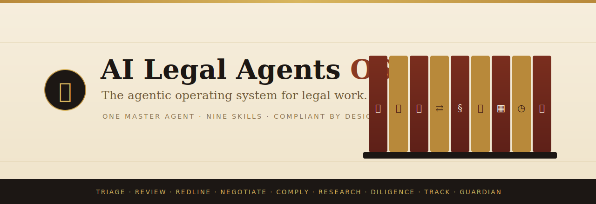

<p align="center">
  
</p>

<h1 align="center">⚖️ AI Legal Agents OS</h1>

<p align="center">
  <strong>Agents · Skills · an operating system for legal work.</strong><br/>
  One master AI agent that runs the whole legal workflow — intake, review, redline,
  negotiate, comply, research, diligence and obligation tracking — not just a chat box.
</p>

<p align="center">
  
  
  
  
  
  
</p>

> **Demonstration only. Not legal advice.** All contracts, parties, regulations,
> metrics and outputs are **synthetic** and generated for showcase purposes. The app
> runs entirely on **deterministic mocks** — there are **no real LLM or external API
> calls**.

---

AI Legal Agents OS pairs two strengths in one workflow:

- **Productivity at scale** — review, research, redlining and repeatable workflow agents across large document sets.
- **Compliant-by-design** — regulations encoded as machine-checkable rules, applied proactively, with cited findings and AI-to-AI oversight.

## ✨ The four surfaces

| Page | What it is |
| --- | --- |
| **`/` Home** | The pitch: Problem · Extent · Impact · ROI · Solution. |
| **`/how-it-works` How it works** | The architecture: a layered stack, an SVG flow diagram (agent → MCP connectors → retrieval/RAG → model), the request lifecycle, and a now-vs-next roadmap. |
| **`/agent` Master Agent** | One conversational agent (M365-Copilot style) that **performs all 9 jobs**, streams its skills executing, and renders a verified, cited artifact for each. |
| **`/evals` Evals** | A golden-set evaluation harness scored by an LLM-as-a-judge across six dimensions. |

## 🧠 The 9 jobs to be done (the skills)

One master agent orchestrates nine specialist skills. Each is a deterministic skill in
`lib/agent/skills.ts` that emits a console trace and a typed artifact, every result
carrying an executive summary with **inline citations** (SEC EDGAR, GDPR, Cornell LII),
severity/score charts and an explicit **recommended changes + next steps** block.

| # | Skill | Job to be done | Artifact |
| --- | --- | --- | --- |
| ⟢ | **Triage** | Classify, prioritize and route an inbound request | Matter card |
| ❖ | **Review** | Surface risks and required changes fast | Risk review |
| ✎ | **Redline** | Mark up a counterparty draft to our standard | Redline set |
| ⇄ | **Negotiate** | Work approved fallbacks, never below walk-away | Negotiation log |
| § | **Comply** | Check clauses against regulation-as-code | Compliance report |
| 📑 | **Research** | Citation-backed answers you can defend | Research memo |
| ▦ | **Diligence** | Extract terms and red flags across many contracts | Diligence matrix |
| ◷ | **Track** | Track obligations, renewals and termination windows | Obligation schedule |
| ✓ | **Guardian** | Verify citations, consistency and safety of every output | Guardian verdict |

## ⚙️ How it works

A **planner-orchestrated master agent** turns the scattered legal workflow into a single
conversation:

```
            ┌──────────────────────────────────────────────────────────┐
  Matter →  │  Master Agent (plan · route)                              │
            │     │                                                     │
            │     ├─▶ MCP connectors  ── tools & data (synthetic)       │
            │     ├─▶ Retrieval / RAG ── grounding + citations          │
            │     ├─▶ Frontier model  ── reasoning                      │
            │     └─▶ Skills (×9)      ── each emits a typed artifact    │
            │                    │                                       │
            │            Guardian (verify) ── citations · safety         │
            └──────────────────────────────────────────────────────────┘
                                 │
                    Verified, cited, execution-ready package
```

1. **Bring the matter.** Drop in a contract, a request, or a question. The agent classifies it and sets priority and SLA.
2. **The agent plans & routes.** It decomposes the job and dispatches the right specialist skills — like an M365 Copilot agent running tools.
3. **Skills execute.** Each skill runs deterministically and emits a real artifact: redline set, compliance report, research memo, obligation schedule.
4. **Guardian verifies & ships.** An AI-to-AI guardian checks citations, consistency and safety, then assembles an audit-trailed package. Evals score it continuously.

The `/how-it-works` page renders this as a live SVG flow diagram, with an explicit
**now (mocked) vs. next (wired)** roadmap.

## 🔌 MCP & MCP Apps

The master agent connects to its tools and data through the **Model Context Protocol
(MCP)** — the open, JSON-RPC 2.0–based standard for wiring agents to external systems. In
this showcase the connectors are deterministic **(mock) MCP servers**, but the shape is
real:

| MCP server | Tools it exposes | Used by |
| --- | --- | --- |
| **Contract & Data-Room MCP** | `fetch_document` · `list_data_room` · `extract_clauses` | triage · review · diligence |
| **Regulation MCP** (regulation-as-code) | `get_rule_pack` · `check_clause` · `cite_finding` | comply |
| **Legal Research MCP** (SEC EDGAR, Cornell LII) | `search_caselaw` · `fetch_citation` · `summarize_authority` | research |
| **Playbook MCP** | `get_redline_standard` · `get_fallback_ladder` · `score_position` | redline · negotiate |
| **Obligations & CLM MCP** | `extract_obligations` · `schedule_renewal` · `assemble_package` | track · guardian |

**MCP Apps in the response.** Every artifact the agent returns — risk review, redline set,
compliance charts, obligation schedule, guardian verdict — is rendered as an **MCP App**
via the **MCP Apps extension (SEP-1865)**. Each skill's tool advertises a UI resource
through `_meta.ui/resourceUri` (a `ui://…` URI), served as `text/html;profile=mcp-app` and
rendered inline by the host in a **sandboxed iframe**. Actions inside a widget (approve a
redline, drill into a citation) call back over **JSON-RPC 2.0 `postMessage`**, which the
host proxies to the MCP server — so the response is interactive, not static.

**Standards it's based on:** the [Model Context Protocol](https://modelcontextprotocol.io)
(JSON-RPC 2.0) and the [MCP Apps extension — SEP-1865](https://github.com/modelcontextprotocol/ext-apps),
finalized in late 2025 and backed by Anthropic and OpenAI.

> All MCP servers here are synthetic and deterministic — no real systems are contacted and
> no network calls are made.

## 🕹️ Try it

In the **Agent** page, click a job in the left rail, use a suggested prompt, or ask in
plain language, e.g.:

- "Triage the new SaaS agreement"
- "Redline it as the customer"
- "Check it against GDPR"
- "Negotiate the liability cap"
- **"Run the full end-to-end mission"** — chains triage → review → redline → compliance → negotiation → verify into one package.
- **📎 Upload a document** — pick one of five synthetic contracts; the agent connects to its (mock) MCP connectors and returns a cited risk review.

In the **Evals** page, press **Run evaluation** to run the golden set of 20 prompts through
an LLM-as-a-judge and watch per-dimension scores, verdicts and judge rationales stream in.

## 🎨 Tech & design

- **Next.js 16** (App Router) · **React 19** · **TypeScript** · **Tailwind CSS v4**.
- Distinctive **"law-library" theme** (oxblood, brass, parchment, ink) with an optional dark **"chambers"** mode — deliberately nothing like a generic IDE theme.
- Fonts: **Fraunces** (display), **Inter** (body), **JetBrains Mono** (console).
- Fully client-side and deterministic — reproducible and credit-free.

## 🚀 Run locally

This repo is a self-contained Next.js app:

```bash
npm install
npm run dev      # http://localhost:3000 (or the next free port)
npm run build    # production build
npm run lint
```

## 🗂️ Project structure

```
app/                 Home, /how-it-works, /agent, /evals + root layout + theme
components/
  agent/             Console, streaming skill-run card, artifact card, doc picker
  evals/             Eval flow diagram + interactive dashboard
  how-it-works/      Architecture SVG flow diagram
  brand, nav, footer, theme provider/toggle, home/reveal
lib/
  brand.ts           Product copy, the 9 JTBDs and ROI
  types.ts           Shared artifact / chat / run types
  architecture.ts    How-it-works stack, connectors and lifecycle data
  agent/
    data.ts          Synthetic contracts, playbook, GDPR rule-pack, case law, data room
    documents.ts     Five synthetic legal documents for upload
    skills.ts        The 9 deterministic JTBD skills + the end-to-end mission
    engine.ts        Intent router (message → skill)
    guidance.ts      Derives recommended changes + next steps per artifact
  evals/
    suites.ts        Golden set (20 prompts) + LLM-as-a-judge scoring
```

---

<p align="center"><sub>Built as an internal showcase. Synthetic data · deterministic mocks · not legal advice.</sub></p>
